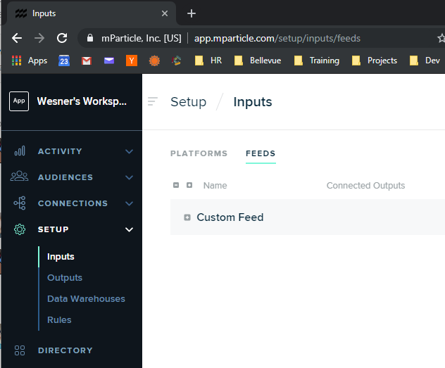
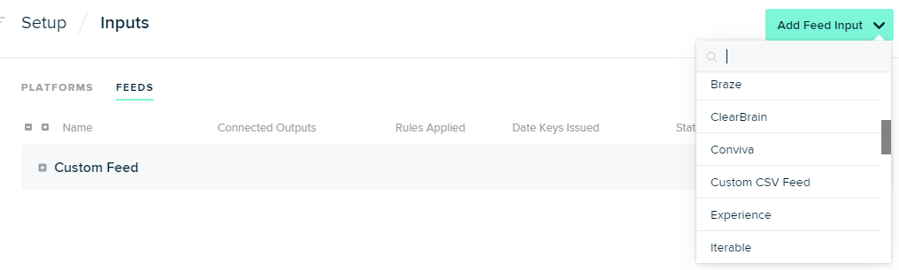
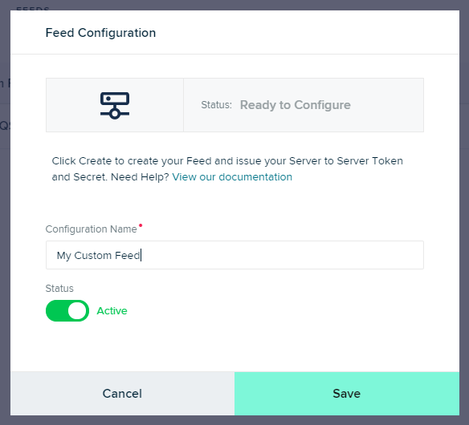
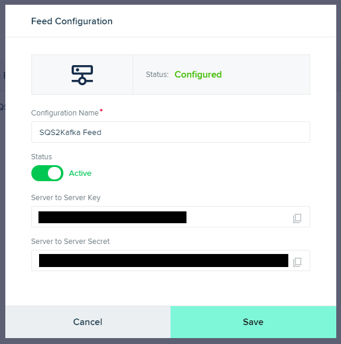
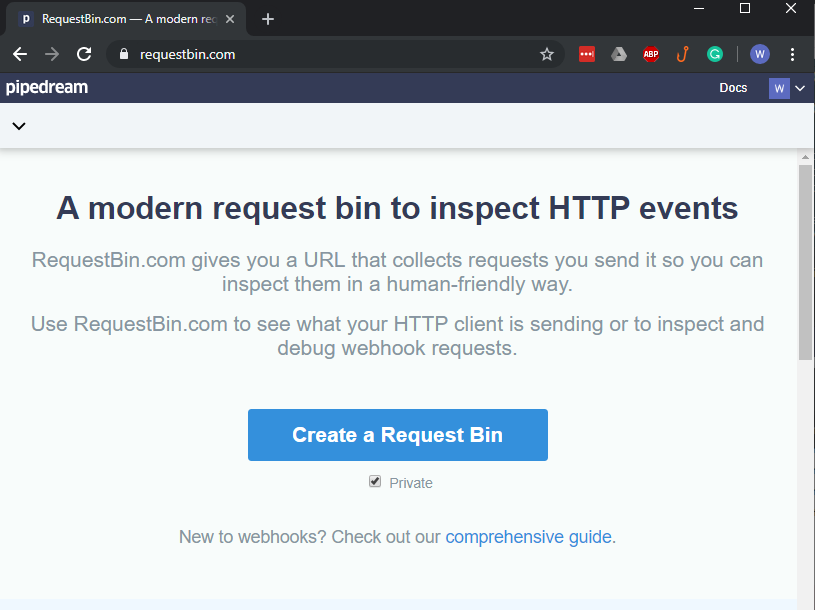
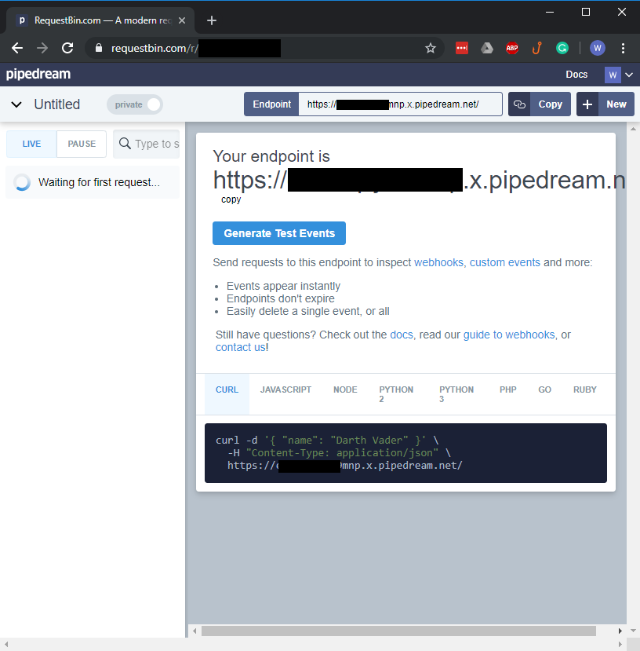
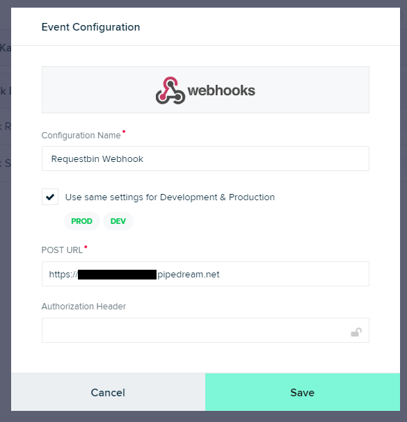

## mParticle Kafka Example

This repo is serves as an example implementation to ingest data into mParticle via a Kafka stream, in a Java environment.

## Run the example

```sh
./gradlew run
```

The code to ingest data in mParticle rests in the nested static class `App.Program`.
The following constants need to be changed in `App.Program`.

```java
private final boolean USE_KAFKA = false;
private final String BOOTSTRAP_SERVERS = "localhost:9092";
private final String TOPIC = "topic";
private final String ACCESS_KEY = "---";
private final String ACCESS_SECRET = "---";
```

## Running with Sample Test Data

To start, we either need to test with an active Kafka cluster or use the 
sample test event data in `Program.testRun`. If USE_KAFKA is false, App.main
will call the `testRun` method instead of the `run` method in `App.Program`.

If this is your first time, make sure USE_KAFKA is initially set to false to test
the mParticle endpoint and access credentials. Also, the application assumes 
that the event stream data will follow the format of the test data and 
does not perform any validation to ensure that it is the case.



An mParticle custom feed needs to be created in the mParticle app website under
Setup/Inputs. Then choose the `Feeds` tab instead of `Platforms`.



If the custom feed does not already appear, look for it in the `Add Feed Input` menu.



Click on the + sign next to `Custom Feed` and create a new custom feed.



A newly created Custom Feed will provide the ACCESS_KEY and ACCESS_SECRET
strings to placed at the top of the Program class.

The custom feed will need to be connected to an output. 



A good output to use is a RequestBin. RequestBin is a free, non-affiliated third-party site. 
This is only for proof of concept. They shouldn't be used for production-level data volumes.
 


Click on create a request bin and get a new endpoint for receiving traffic. The traffic displays on the same webpage.


 
Add a new Webhook forwarder from Setup/Outputs in app
website and configure the webhook to the POST url that you requested from RequestBin. 

You will need create a connection in the `CONNECTION` sections between your input (Custom Feed) and your output
(the RequestBin Webhook forwarder).

## Running with Kafka

To start running with Kafka, change BOOTSTRAP_SERVERS to point 
to the bootstrap servers of your Kafka cluster. Also, change 
TOPIC to refer to the topic stream that the program will be consuming from.

There are a few considerations when USE_KAFKA is turned on:

1) The Kafka connection is assumed to be plaintext. Additional
consumer config properties in the `run` method need to be 
specified to support any encryption and/or authentication.

2) There are specific assumptions in the sample code about the
 format of the json and no validation is performed. You need to 
 modify the code to recognize the format your company uses. The
 sample code is illustrative and is designed to work with the 
 test data used and provided below.

## Create a `Batch`

All data that passes through mParticle does so in the form of a "batch." A batch describes identities, attributes, events, and other information related to a *single user*. This SDK lets you upload either single batches or multiple batches at a time.

For every event:
 - check to see if that event, regardless of its type, has any user or device identifying information, add the information to the batch in the form of either user identities (eg email, customerid), device identities (idfa,gaid), or user attributes
- then based on the event log a different type of mParticle event type (either a custom event, screen event, or other)

The full schema of a batch is documented in the [mParticle Events API overview](https://docs.mparticle.com/developers/server/http/). The models in this SDK directly match the JSON referenced in the overview.

```java
Batch batch = new Batch();
batch.environment(Batch.Environment.DEVELOPMENT);

// Set user identities
batch.userIdentities(
        new UserIdentities()
                .customerId("1234")
                .email("example@foo.com")
);

// Set device identities
batch.deviceInfo(
        new DeviceInformation()
                .iosAdvertisingId("5864e6b0-0d46-4667-a463-21d9493b6c10")
);

// Set user attributes
Map<String, Object> userAttributes = new HashMap<>();
userAttributes.put("foo", "bar");
userAttributes.put("foo-array", new String[]{"bar1", "bar2"});
userAttributes.put("foo-array-2", Arrays.asList("bar3","bar4"));
batch.userAttributes(userAttributes);

```

> It's critical to include either user or device identities with your server-side data

## Create Events

All mParticle events have a similar structure:

- `event_type`: this is the type of event, such as `custom_event` and `commerce_event`
- `data`: this contains common properties of all events, as well as properties specific to each `event_type`

The following are common properties that all events share, as represented by the `CommonEventData` class:

```javascript
{
	"data" :
	{
		"event_id" : 6004677780660780000,
		"source_message_id" : "e8335d31-2031-4bff-afec-17ffc1784697",
		"session_id" : 4957918240501247982,
		"session_uuid" : "91b86d0c-86cb-4124-a8b2-edee107de454",
		"timestamp_unixtime_ms" : 1402521613976,
		"location" : {},
		"device_current_state" : {},
		"custom_attributes": {},
		"custom_flags": {}
	},
	"event_type" : "custom_event"
}

```

The Java Server Events SDK represents this structure via an event and an event-data class for each unique event type. For example, `CustomEvent` which can be populated by a `CustomEventData` instance.

### Custom Events

```java
Map customAttributes = new HashMap<>();
customAttributes.put("foo", "bar");
CustomEvent event = new CustomEvent().data(
        new CustomEventData()
                .eventName("My Custom Event Name")
                .customEventType(CustomEventData.CustomEventType.LOCATION)
);
event.getData().customAttributes(customAttributes);
```

### Screen Events

```java
ScreenViewEvent event = new ScreenViewEvent().data(
        new ScreenViewEventData()
                .screenName("foo screen")
);
```

### Commerce Events

```java
Product product = new Product()
    .totalProductAmount(new BigDecimal("123.12"))
    .id("product-id")
    .name("product-name");
ProductAction action = new ProductAction()
    .action(ProductAction.Action.PURCHASE)
    .totalAmount(new BigDecimal("123.12"))
    .transactionId("foo-transaction-id")
    .products(Arrays.asList(product));
CommerceEvent event = new CommerceEvent().data(
        new CommerceEventData().productAction(action)
);
```

### Other Events

|event_type|Description|
|----------|-----------|
|custom_event|A Custom event with a name and optional attributes.
|commerce_event|A Commerce event.|
|session_start |Session Start event.|
|session_end	|Session End event.|
|screen_view	|Screen View.|
|uninstall	|App was uninstalled.|
|crash_report	|Crash Report.|
|opt_out	|User Opt-Out.|
|push_registration	|Registration of the device push token.|
|application_state_transition	|An event fired when the application starts, exits, comes into foreground, or enters background.|
|push_message	|A push message is received.|
|network_performance	|An event containing network performance details on external http calls made from the application.|
|breadcrumb	|Breadcrumbs are used for crash reporting to understand which events lead up to a crash.|

https://docs.mparticle.com/developers/server/json-reference/#events

## Full Upload Example

### Create an `EventsApi` instance

`EventsApi` is a Retrofit-compatible interface, allowing you to use the rich feature-set of the Retrofit and OkHttp libraries, such as queueing and asynchronous requests.

Create an API instance with your mParticle workspace credentials. These credentials may be either "platform" (iOS, Android, etc) or "custom feed" keys:

```java
EventsApi api = new ApiClient("API KEY", "API-SECRET")
                .createService(EventsApi.class);
```

> The mParticle Events API leverages HTTP basic authentication over TLS. 

### Perform a Synchronous Upload

The SDK supports both multi-batch ("bulk") or single-batch uploads:

```java
//assemble your Batch
Batch batch = new Batch();

batch.environment(Batch.Environment.DEVELOPMENT);
batch.userIdentities(new UserIdentities()
        .customerId("1234")
        .email("example@foo.com")
);

// Add your events
Map customAttributes = new HashMap<>();
customAttributes.put("foo", "bar");
CustomEvent customEvent = new CustomEvent().data(
        new CustomEventData()
                .eventName("foo event")
                .customEventType(CustomEventData.CustomEventType.LOCATION)
);
customEvent.getData().customAttributes(customAttributes);
batch.addEventsItem(customEvent);

ScreenViewEvent screenEvent = new ScreenViewEvent().data(
        new ScreenViewEventData()
                .screenName("foo screen")
);
batch.addEventsItem(screenEvent);

EventsApi api = new ApiClient("API KEY", "API-SECRET").createService(EventsApi.class);

// Perform a bulk upload
List<Batch> bulk = new ArrayList<>();
bulk.add(batch);
Call<Void> bulkResult = api.bulkUploadEvents(bulk);
Response<Void> bulkResponse = bulkResult.execute();

// Perform a single upload
Call<Void> singleResult = api.uploadEvents(batch);
Response<Void> singleResponse = singleResult.execute();
```

## Sample Test Data

The following JSON schema is used in the included test program. This is just an example of what a Kafka stream might produce - for your Kafka stream you'll have to adapt the example to conform to your schema.

```json5
// Page views or impressions
{
    "event_type" : "page",
    "user_id" : "123",
    "properties": {
        "category": "electronics",
        "subcategory": "televisions"
    }
}
```

```json5
// Track events - Explicit user actions
{
    "event_type" : "event",
    "event_name" : "add_to_cart",
    "user_id" : "123",
    "properties": {
       "currency_code": "USD",
       "price": "1000",
       "name": "Acme 42\" LED TV",
       "transaction_id": "abcdef12345",
       "sku": "12345"
    }
}
```

```json5
// Identity events to 
{
    "event_type" : "identity",
    "customer_id" : "123",
    "properties": {
        "email" : "john.doe@gmail.com",
        "first_name" : "John",
        "last_name" : "Doe",
        "idfa" : "5864e6b0-0d46-4667-a463-21d9493b6c10"
    }
}
```